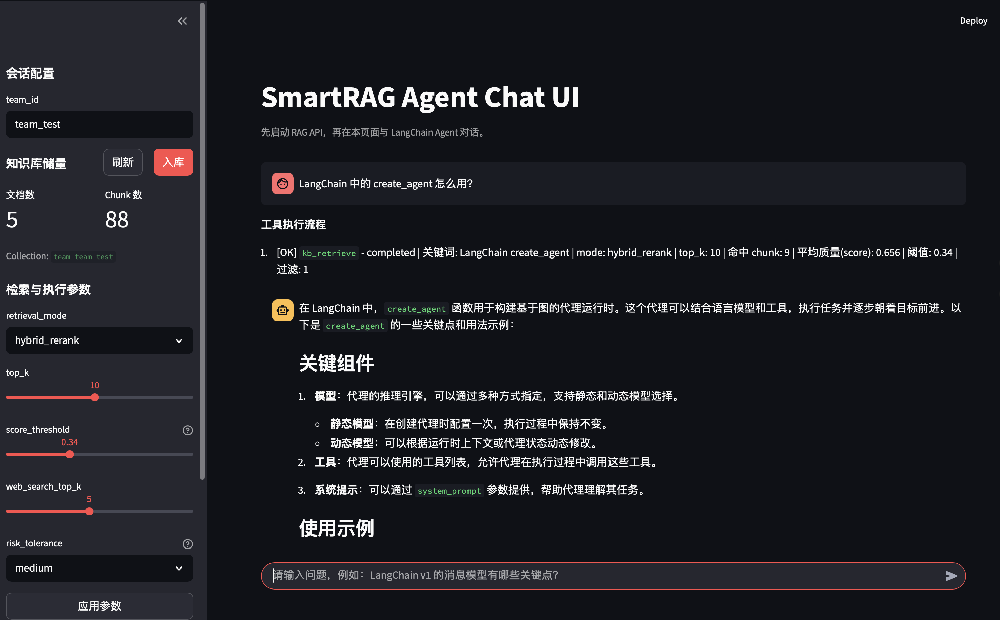

# SmartRAG

一个用于学习 **Agent 与 RAG** 工程实践的项目：
- 知识库系统：FastAPI + Chroma（按 `team_id` 隔离）
- 检索链路：Vector + BM25 + Rerank
- Agent 系统：LangChain Agent（独立 `agent_app`），通过 tools 调用 RAG API
- 风险治理：Web 参与写入时审批门控（middleware）

## 界面展示


## 架构说明
本项目采用解耦架构：
1. `app/`：RAG API 服务（入库、检索、统计）
2. `agent_app/`：独立 Agent Chat UI（Streamlit + LangChain）
3. Agent 不通过后端 `/v1/agent/*` 暴露，而是通过工具访问 RAG API

## 核心能力
1. 文档入库：文件入库、文本入库、批量上传
2. 检索接口：`/v1/query` 仅返回证据 `chunks`（不做答案生成）
3. 混合检索：`vector / hybrid / hybrid_rerank`
4. Agent 工具链：`kb_retrieve`、`web_search`、`kb_ingest`、`kb_update`
5. 风控审批：Web 信息参与写入时触发 `pending_action` 审批
6. UI 可观测：流式输出、工具执行流程、关键词/命中数/平均质量显示
7. 会话调参：`top_k`、`retrieval_mode`、`score_threshold`、`web_search_top_k`、`risk_tolerance`

## 环境准备
建议使用 conda 环境 `SmartRAG`：

```bash
conda create -n SmartRAG python=3.11 -y
conda activate SmartRAG
pip install -r requirements.txt
```

初始化配置：

```bash
cp .env.example .env
```

至少需要配置：
1. `OPENAI_API_KEY`
2. `OPENAI_BASE_URL`（若使用兼容网关）
3. `TAVILY_API_KEY`（仅在 `WEB_SEARCH_PROVIDER=tavily` 时需要）

## 快速启动
1. 启动 RAG API：

```bash
make run-rag-api
```

2. 启动 Agent UI：

```bash
make run-agent-ui
```

3. 打开页面：
- `http://127.0.0.1:8501`

## 最小演示流程（推荐）
1. 在 UI 侧边栏设置 `team_id`（例如 `team_demo`）
2. 用“批量上传文件”或“上传文本入库”写入知识库
3. 提问内部知识问题，观察 `kb_retrieve` 工具流程
4. 提问需要联网补充的问题，观察 `web_search -> kb_ingest(待审批)`
5. 在审批中心点击“批准并执行”后再次提问，验证知识已沉淀

## API 概览
RAG API 前缀：`/v1`

1. `GET /health`
2. `POST /documents/ingest`（文件路径入库）
3. `POST /documents/text`（文本入库）
4. `POST /documents/upload`（批量上传入库，base64）
5. `GET /documents/stats/{team_id}`（文档/Chunk 统计）
6. `POST /query`（纯检索，返回 `chunks/confidence/limitations`）

## 常用命令
```bash
make help
make ingest TEAM_ID=team_test INPUT_DIR=data/raw/phase1_samples
make eval TEAM_ID=team_test RETRIEVAL_MODE=hybrid_rerank
make summary RESULT_CSV=eval/phase2_baseline/results_latest.csv
make test
make chroma-peek TEAM=team_test
```

## 目录结构（关键）
```text
SmartRAG/
├── app/                 # RAG API
├── agent_app/           # 独立 Agent UI + tools + runtime
├── scripts/             # 入库/评测/运维脚本
├── tests/integration/   # 集成测试
├── eval/                # 评测产物
├── tutorials/           # 分阶段教程
└── docs/                # 架构与风险规则文档
```

## 教程与文档
1. 总流程：`LEARNING_WORKFLOW.md`
2. 分阶段教程：`tutorials/phase0~phase5_*.md`
3. 解耦运行说明：`docs/agent_decoupled_runtime.md`
4. 风险规则：`docs/risk_rules_phase5.md`

## 常见问题
1. UI 启动时报 Streamlit 欢迎页/退出
- 使用 `make run-agent-ui`（已设置 headless 与关闭统计）

2. `/v1/query` 有结果但 Agent 回答不稳定
- 检查 UI 侧边栏参数：`retrieval_mode/top_k/score_threshold`

3. 入库重复但统计为 0
- 可能是历史脏状态；项目已内置“指纹存在但无 chunk”的自愈重建，建议重新入库并查看 `/v1/documents/stats/{team_id}`
